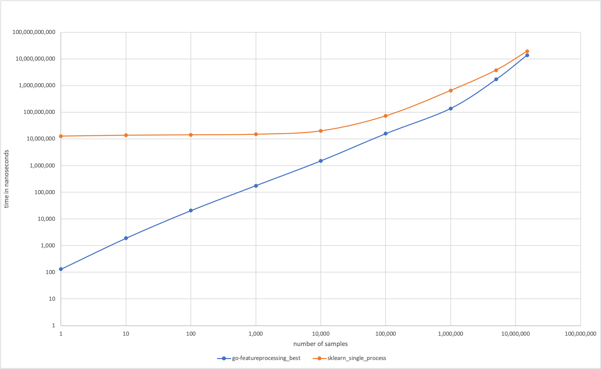
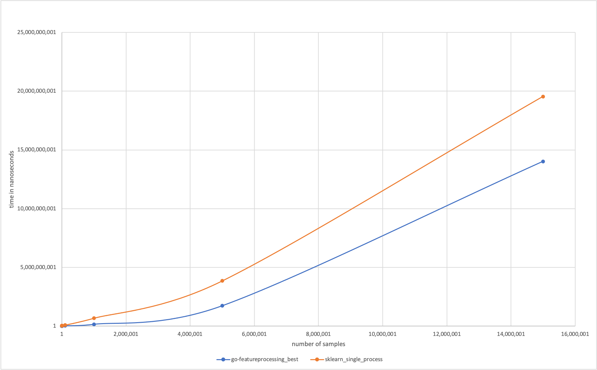

# go-featureprocessing

[](https://goreportcard.com/report/github.com/nikolaydubina/go-featureprocessing)
[](https://codecov.io/gh/nikolaydubina/go-featureprocessing)
[](https://pkg.go.dev/github.com/nikolaydubina/go-featureprocessing)
[](https://github.com/avelino/awesome-go)

> _Perfect for low latency machine learning inference of data models in Go_

Ultra-fast and simple feature processing in Go with feature parity of [sklearn](https://scikit-learn.org/stable/modules/preprocessing.html).

- ✅ Does not cross `cgo` boundary
- ✅ No memory allocation
- ✅ No reflection
- ✅ Convenient serialization
- ✅ Generated code has 100% test coverage and benchmarks
- ✅ Fitting
- ✅ UTF-8
- ✅ Parallel batch transform
- ✅ Faster than sklearn in batch mode

```go
//go:generate go run github.com/nikolaydubina/go-featureprocessing/cmd/generate -struct=Employee

type Employee struct {
	Age         int     `feature:"identity"`
	Salary      float64 `feature:"minmax"`
	Kids        int     `feature:"maxabs"`
	Weight      float64 `feature:"standard"`
	Height      float64 `feature:"quantile"`
	City        string  `feature:"onehot"`
	Car         string  `feature:"ordinal"`
	Income      float64 `feature:"kbins"`
	Description string  `feature:"tfidf"`
	SecretValue float64
}
``` 

Code above will generate a new struct as well _benchmarks_ and _tests_ using [google/gofuzz](https://github.com/google/gofuzz).
```go
employee := Employee{
   Age:         22,
   Salary:      1000.0,
   Kids:        2,
   Weight:      85.1,
   Height:      160.0,
   City:        "Pangyo",
   Car:         "Tesla",
   Income:      9000.1,
   SecretValue: 42,
   Description: "large text fields is not a problem neither, tf-idf can help here too! more advanced NLP will be added later!",
}

var fp EmployeeFeatureTransformer

config, _ := ioutil.ReadAll("employee_feature_processor.json")
json.Unmarshal(config, &fp)

fp.Transform(&employee)
// []float64{22, 1, 0.5, 1.0039999999999998, 1, 1, 0, 0, 0, 1, 5, 0.7674945674619879, 0.4532946552278861, 0.4532946552278861}

fp.FeatureNames()
// []string{"Age", "Salary", "Kids", "Weight", "Height", "City_Pangyo", "City_Seoul", "City_Daejeon", "City_Busan", "Car", "Income", "Description_text", "Description_problem", "Description_help"}
```

You can also fit transformer based on data
```go
fp := EmployeeFeatureTransformer{}
fp.Fit([]Employee{...})

config, _ := json.Marshal(data)
_ = ioutil.WriteFile("employee_feature_processor.json", config, 0644)
```

This transformer can be serialized and de-serialized by standard Go routines.
Serialized transformer is easy to read, update, and integrate with other tools.
```json
{
   "Age_identity": {},
   "Salary_minmax": {"Min": 500, "Max": 900},
   "Kids_maxabs": {"Max": 4},
   "Weight_standard": {"Mean": 60, "STD": 25},
   "Height_quantile": {"Quantiles": [20, 100, 110, 120, 150]},
   "City_onehot": {"Values": ["Pangyo", "Seoul", "Daejeon", "Busan"]},
   "Car_ordinal": {"Mapping": {"BMW": 90000, "Tesla": 1}},
   "Income_kbins": {"Quantiles": [1000, 1100, 2000, 3000, 10000]},
   "Description_tfidf": {
      "Mapping": {"help": 2, "problem": 1, "text": 0},
      "Separator": " ",
      "DocCount": [1, 2, 2],
      "NumDocuments": 2,
      "Normalizer": {}
   }
}
```

Or you can manually initialize it.
```go
fp := EmployeeFeatureTransformer{
   Salary: MinMaxScaler{Min: 500, Max: 900},
   Kids:   MaxAbsScaler{Max: 4},
   Weight: StandardScaler{Mean: 60, STD: 25},
   Height: QuantileScaler{Quantiles: []float64{20, 100, 110, 120, 150}},
   City:   OneHotEncoder{Values: []string{"Pangyo", "Seoul", "Daejeon", "Busan"}},
   Car:    OrdinalEncoder{Mapping: map[string]float64{"Tesla": 1, "BMW": 90000}},
   Income: KBinsDiscretizer{QuantileScaler: QuantileScaler{Quantiles: []float64{1000, 1100, 2000, 3000, 10000}}},
   Description: TFIDFVectorizer{
      NumDocuments:    2,
      DocCount:        []uint{1, 2, 2},
      CountVectorizer: CountVectorizer{Mapping: map[string]int{"text": 0, "problem": 1, "help": 2}, Separator: " "},
   },
}
```

### Supported transformers

- [x] `numerical` MinMaxScaler
- [x] `numerical` MaxAbsScaler
- [x] `numerical` StandardScaler
- [x] `numerical` QuantileScaler
- [x] `numerical` SampleNormalizerL1
- [x] `numerical` SampleNormalizerL2
- [x] `categorical` OneHotEncoder
- [x] `categorical` OrdinalEncoder
- [x] `numerical` KBinsDiscretizer
- [x] `text` CountVectorizer
- [x] `text` TFIDFVectorizer

### Benchmarks

For typical use, with this struct encoder you can get ~100ns processing time for a single sample. How fast you need to get? Here are some numbers:

```
                       0 - C++ FlatBuffers decode
                     ...
                   200ps - 4.6GHz single cycle time
                1ns      - L1 cache latency
               10ns      - L2/L3 cache SRAM latency
               20ns      - DDR4 CAS, first byte from memory latency
               20ns      - C++ raw hardcoded structs access
               80ns      - C++ FlatBuffers decode/traverse/dealloc
 ---------->  130ns      - go-featureprocessing typical processing
              150ns      - PCIe bus latency
              171ns      - Go cgo call boundary, 2015
              200ns      - some High Frequency Trading FPGA claims
              800ns      - Go Protocol Buffers Marshal
              837ns      - Go json-iterator/go json decode
           1µs           - Go Protocol Buffers Unmarshal
           1µs           - High Frequency Trading FPGA
           3µs           - Go JSON Marshal
           7µs           - Go JSON Unmarshal
           9µs           - Go XML Marshal
          10µs           - PCIe/NVLink startup time
          17µs           - Python JSON encode or decode times
          30µs           - UNIX domain socket, eventfd, fifo pipes latency
          30µs           - Go XML Unmarshal
         100µs           - Redis intrinsic latency
         100µs           - AWS DynamoDB + DAX
         100µs           - KDB+ queries
         100µs           - High Frequency Trading direct market access range
         200µs           - 1GB/s network air latency
         200µs           - Go garbage collector latency 2018
         500µs           - NGINX/Kong added latency
     10ms                - AWS DynamoDB
     10ms                - WIFI6 "air" latency
     15ms                - AWS Sagemaker latency
     30ms                - 5G "air" latency
    100ms                - typical roundtrip from mobile to backend
    200ms                - AWS RDS MySQL/PostgreSQL or AWS Aurora
 10s                     - AWS Cloudfront 1MB transfer time
```

This is significantly faster than sklearn, or calling sklearn from Go, for few samples.
And it performs similarly to sklearn for large number of samples.



For full benchmarks go to `/docs/benchmarks`, some extract for typical struct: 
```
goos: darwin
goarch: amd64
pkg: github.com/nikolaydubina/go-featureprocessing/cmd/generate/tests
BenchmarkAllTransformersFeatureTransformer_Transform-8                                         	11534653	       310 ns/op	     288 B/op	       1 allocs/op
BenchmarkAllTransformersFeatureTransformer_Transform_Inplace-8                                 	20954436	       167 ns/op	       0 B/op	       0 allocs/op
BenchmarkAllTransformersFeatureTransformer_TransformAll_10elems-8                              	 1504075	      2390 ns/op	    3072 B/op	       1 allocs/op
BenchmarkAllTransformersFeatureTransformer_TransformAll_100elems-8                             	  137522	     26397 ns/op	   27264 B/op	       1 allocs/op
BenchmarkAllTransformersFeatureTransformer_TransformAll_1000elems-8                            	   13261	    269251 ns/op	  303105 B/op	       1 allocs/op
BenchmarkAllTransformersFeatureTransformer_TransformAll_10000elems-8                           	    1269	   2717324 ns/op	 2801668 B/op	       1 allocs/op
BenchmarkAllTransformersFeatureTransformer_TransformAll_100000elems-8                          	     120	  32259475 ns/op	28803072 B/op	       1 allocs/op
BenchmarkAllTransformersFeatureTransformer_TransformAll_1000000elems-8                         	      10	 329235362 ns/op	280002560 B/op	       1 allocs/op
BenchmarkAllTransformersFeatureTransformer_TransformAll_10elems_8workers-8                     	  460125	      8256 ns/op	    3088 B/op	       2 allocs/op
BenchmarkAllTransformersFeatureTransformer_TransformAll_100elems_8workers-8                    	  114345	     37036 ns/op	   32784 B/op	       2 allocs/op
BenchmarkAllTransformersFeatureTransformer_TransformAll_1000elems_8workers-8                   	   12106	    273372 ns/op	  311313 B/op	       2 allocs/op
BenchmarkAllTransformersFeatureTransformer_TransformAll_10000elems_8workers-8                  	    1696	   2582489 ns/op	 3047448 B/op	       2 allocs/op
BenchmarkAllTransformersFeatureTransformer_TransformAll_100000elems_8workers-8                 	     211	  16258268 ns/op	28803092 B/op	       2 allocs/op
BenchmarkAllTransformersFeatureTransformer_TransformAll_1000000elems_8workers-8                	      22	 148782487 ns/op	296001552 B/op	       2 allocs/op
BenchmarkAllTransformersFeatureTransformer_TransformAll_5000000elems_8workers-8                	       2	2049761654 ns/op	1440006160 B/op	    2 allocs/op
```

### [beta] Reflection based version

If you can't use `go:gencode` version, you can try relfection based version.
Note, that reflection version intrudes overhead that is particularly noticeable if your struct has a lot of fields.
You would get ~2x time increase for struct with large composite transformers. 
And you would get ~20x time increase for struct with 32 fields.
Note, some features like serialization and de-serialization are not supported yet.

Benchmarks:
```
goos: darwin
goarch: amd64

// reflection
pkg: github.com/nikolaydubina/go-featureprocessing/structtransformer
BenchmarkStructTransformerTransform_32fields-4                           1732573              2079 ns/op             512 B/op          2 allocs/op

// non-reflection
pkg: github.com/nikolaydubina/go-featureprocessing/cmd/generate/tests
BenchmarkWith32FieldsFeatureTransformer_Transform-8                     31678317	       116 ns/op	     256 B/op	       1 allocs/op
BenchmarkWith32FieldsFeatureTransformer_Transform_Inplace-8           	80729049	        43 ns/op	       0 B/op	       0 allocs/op
```

### Profiling

From profiling benchmarks for struct with 32 fields, we see that reflect version takes much longer and spends time on what looks like reflection related code.
Meanwhile `go:generate` version is fast enough to compar to testing routines themselves and spends 50% of the time on allocating single output slice, which is good since means memory access is a bottleneck.
Run `make profile` to make profiles.
Flamegraphs were produced from pprof output by https://www.speedscope.app/.

gencode:


reflect:


### Comments, Corrections, Feature Requests, Improvements

Feel free to open an issue or submit a PR! Some outstanding tasks:

- [ ] multiple transformers for same field
- [ ] order fields in order different from struct declaration
- [ ] hand crafted assembly, SIMD support

### Reference

- https://dave.cheney.net/2016/01/18/cgo-is-not-go
- https://github.com/json-iterator/go
- https://benchmarksgame-team.pages.debian.net/benchmarksgame/fastest/go.html
- https://github.com/shmuelamar/python-serialization-benchmarks
- https://shijuvar.medium.com/benchmarking-protocol-buffers-json-and-xml-in-go-57fa89b8525
- https://gist.github.com/shijuvar/25ad7de9505232c87034b8359543404a#file-order_test-go
- https://google.github.io/flatbuffers/flatbuffers_benchmarks.html
- https://www.cockroachlabs.com/blog/the-cost-and-complexity-of-cgo/
- https://en.wikipedia.org/wiki/CAS_latency
